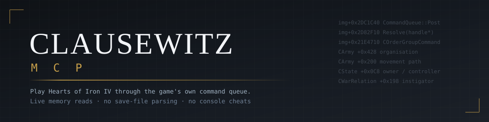

<p align="center">
  
</p>

<p align="center">
  <b>Let an AI play Hearts of Iron IV by clicking the same buttons you do.</b><br>
  <sub>Reads the live process. Sends orders through the game's own command queue.</sub>
</p>

<p align="center">
  
  
  
  
  
</p>

<p align="center">
  <a href="#quick-start">Quick start</a> ·
  <a href="#what-it-does">What it does</a> ·
  <a href="#how-it-works">How it works</a> ·
  <a href="#roadmap">Roadmap</a> ·
  <a href="research/FINDINGS.md">RE notes</a>
</p>

---

Paradox never shipped a way to reach live game state. There's no IPC, no scripting hook
that sees the running simulation, no symbols. Just a stripped 68 MB binary.

So this reads the process memory directly, and pushes actions back through
`CCommandQueue`, which is the path your mouse clicks take. That detail matters more than
it sounds. Because the orders go through the real channel, the game still runs
`CanExecute` on every one of them. Hand an army group to a general who isn't in the
current government and you get refused, with the same reason a player would get.

```console
$ python3 clausewitz.py status
1936.01.01.11  --  German Reich (GER)
  factories : 35 civilian  28 military  10 dockyards
  political power: 2   stability: 75%   war support: 30%
  multiplayer: False (1 players)
  at war: False   active land combats: 0
```

### Why not just parse the save file?

Because saves are a snapshot written on autosave, and almost nothing you need for a
decision survives to disk. Organisation this hour. The damage rate inside a battle
that's happening right now. Which province a division is walking toward, and how far
along it is. You can only get that from the heap.

---

## Quick start

```bash
git clone https://github.com/smerss/Clausewitz-MCP
cd Clausewitz-MCP
pip install -r requirements.txt     # numpy, that's the whole list
python3 clausewitz.py doctor
```

`doctor` looks for your install in the usual Steam places, in extra Steam library
drives, and in WSL mounts. If it comes up empty, point it yourself:

```bash
export HOI4_PATH="$HOME/.steam/steam/steamapps/common/Hearts of Iron IV"
```

Reading another process needs permission. Run as root, or do this once per boot:

```bash
sudo sysctl -w kernel.yama.ptrace_scope=0
```

Then add it to your MCP client:

```bash
claude mcp add hoi4 -- python3 /path/to/Clausewitz-MCP/clausewitz.py serve
```

<details>
<summary>Config file instead (Claude Desktop, Cursor, anything with stdio MCP)</summary>

```json
{
  "mcpServers": {
    "hoi4": {
      "command": "python3",
      "args": ["/path/to/Clausewitz-MCP/clausewitz.py", "serve"],
      "env": { "HOI4_PATH": "/path/to/Hearts of Iron IV" }
    }
  }
}
```

More examples in [`mcp/config/`](mcp/config/).
</details>

---

## What it does

107 tools covering focus tree, research, production, construction, politics, decisions,
diplomacy, armies, fleets, templates and save analysis. Most of that is plumbing. The
interesting parts are below.

### Attacks it won't make, and why

Every coefficient here is read out of the shipped game files, `common/terrain/00_terrain.txt`
and `common/defines/00_defines.lua`. Not from a wiki, and not from memory.

```
attack   -> 11529  | 4 divisions from 3 directions (limit 11, width 108/120)
skip     -> 11444  | ratio 0.47 < 1.15 needed
                     (forest -15%, river crossing(small) -30%, entrenchment 9.0 +18%)
skip     ->  9517  | ratio 1.62 < 2.00 needed (urban -30%, entrenchment 3.0 +6%)
```

That river penalty comes from `rivers.bmp`. Crossings aren't stored anywhere convenient,
so they get recovered from the pixel borders between provinces: 4,385 of them, cached on
first run.

### Piling on divisions makes an attack worse

```
COMBAT_STACKING_START   = 5      COMBAT_STACKING_EXTRA   = 3
COMBAT_STACKING_PENALTY = -0.02  (per division over the line, applied to everything)
```

Ten divisions attacking from one direction is a 10% penalty on the whole attack. The fix
is another direction, not another division, since each direction raises both the stacking
allowance and the combat width. The planner works that out before committing.

### Encirclements

One province almost never cuts a front of any width, so the search runs over sets of one,
two and three provinces, looking for the cheapest cut that disconnects enemy divisions
from their capital. It holds the plan across ticks and attacks whichever piece it can
currently reach.

```
encircle -> 334    | POCKET: 2 enemy divisions cut off
                     6 divisions from 3 directions (limit 11, width 108/120)
```

Pockets don't get attacked immediately. Units carry 72 hours of supply, so it waits on
the game's `out_of_supply_days` counter instead of assuming that a graph cut means
starvation. That distinction came from a pocket that was sitting at 108% supply the whole
time, quietly fed by a port.

### Combat is read, never simulated

Reimplementing HOI4's combat maths would drift out of sync with the next patch. The game
already computes, every tick, how much damage each side is taking. The engine reads that,
smooths it, and divides it into each side's organisation pool. Terrain, doctrine, air
support, entrenchment and supply are already inside those numbers because the game put
them there.

### It can sleep

```python
hoi4_wait_for(max_days=30, signals=["focus", "research", "war"])
→ woke_because: ["focus finished/changed: industrial_effort -> None"]
```

Checking every second burns tokens. Never checking misses things. This watches the game
and returns when something needs a decision, and it always returns by `max_days`, because
nothing here is allowed to wait forever.

### Speed

The micro engine runs once per in-game day. A tick is about 46 ms. It used to be a full
second, almost all of it spent reading 26,826 province objects one at a time to work out
who owned what. Province-to-state membership never changes during a game, so that half
now comes from static files and only ownership is read live. 646 ms down to 35 ms,
checked against the old path across all 10,272 provinces with no disagreements.

---

## How it works

```
                    ┌──────────────────────────────────────────┐
   MCP client ──────▶  mcp/server.py      JSON-RPC over stdio  │
                    └───────────────┬──────────────────────────┘
                                    │
                    ┌───────────────▼──────────────────────────┐
                    │  calling/      the memory layer          │
                    │                                          │
   reads  ──────────┼─▶ process_vm_readv   never stops the game│
   actions ─────────┼─▶ CCommandQueue::Post  the player's path │
                    └───────────────┬──────────────────────────┘
                                    │
                    ┌───────────────▼──────────────────────────┐
                    │  Hearts of Iron IV   (stripped, 68 MB)   │
                    └──────────────────────────────────────────┘
```

| directory | what's in it |
|---|---|
| **`mcp/`** | the server and client configs. Thin. |
| **`calling/`** | memory access, the game model, generated tables. This is the part worth reusing if you're building something else. |
| **`calling/tables/`** | plain text reference: verified call addresses, struct offsets, 358 player commands, handle types, terrain constants |
| **`research/`** | scanners, dumps, and [`FINDINGS.md`](research/FINDINGS.md) |

None of it started from a symbol name. Classes came out of Itanium C++ RTTI, 22,479
typeinfo records worth. Function boundaries came from `.eh_frame_hdr`, 128,144 of them.
The struct layouts came from the game's serializer, which writes field names next to
offsets when it saves, so `CArmy+0x428` is called `organisation` here because that's what
Paradox calls it.

After a patch, regenerate:

```bash
python3 clausewitz.py tables
```

---

## Safety

Reads never stop the game. Calls do, because on Linux they ptrace-stop all 28 threads and
hijack the main one, so anything running in a loop is read-only and only drops that guard
to post a batch of orders inside a single attach.

Three rules live in the code. Each one cost something:

| rule | what it cost |
|---|---|
| Only call addresses whose signature was recovered by disassembly | two guessed virtuals segfaulted the game |
| Check handle types before posting | passing `CCharacter` (73) where the game wanted `CArmyLeader` (4713): one crash, and separately one silent no-op that took a while to notice |
| No injected calls inside a loop | a status call inside a tick loop froze a live multiplayer session, audio and all |

The write-ups are in [`FINDINGS.md`](research/FINDINGS.md). The reasoning is more useful
than the rule.

---

## Roadmap

- [x] Live state reads, 107 MCP tools
- [x] Player command channel with the game's own legality checks
- [x] Combat read from the game's damage output
- [x] Terrain, rivers, forts, stacking and combat width in the planner
- [x] Encirclement search over the province graph
- [x] Turn loop with wake-on-event
- [ ] **Windows port. At 50 ⭐ I'll build it.** The framework doesn't care about the OS.
      What's missing is a PE backend (`ReadProcessMemory`, `CreateRemoteThread`) and,
      the slower half, regenerating every offset table against `hoi4.exe`, since all of
      them came out of the Linux ELF.
- [ ] Air and navy micro. The commands are extracted; none have been fired in anger.
- [ ] Peace conference automation

Linux only today. That's a fact about the offset tables, not about the design.

---

## Contributing

The Windows port is the most useful thing anyone could pick up, and it's self-contained.
[`research/README.md`](research/README.md) spells out both halves.

After that, the unwrapped command areas. Division templates (25 commands), air missions
(35), navy (42), intelligence (20). All of them are extracted with their parameter
layouts and none have been tested in-game. `calling/tables/commands.txt` is the map.

Found an offset that moved in a newer patch? Open an issue with the version and what
broke.

---

<p align="center">
  <sub>Not affiliated with Paradox Interactive. Built for single-player;<br>
  multiplayer is detected and the action surface narrows on its own.</sub><br><br>
  <sub>MIT, see <a href="LICENSE">LICENSE</a></sub>
</p>

<p align="center">
  <b>A ⭐ helps, and it's what unlocks the Windows port.</b>
</p>
